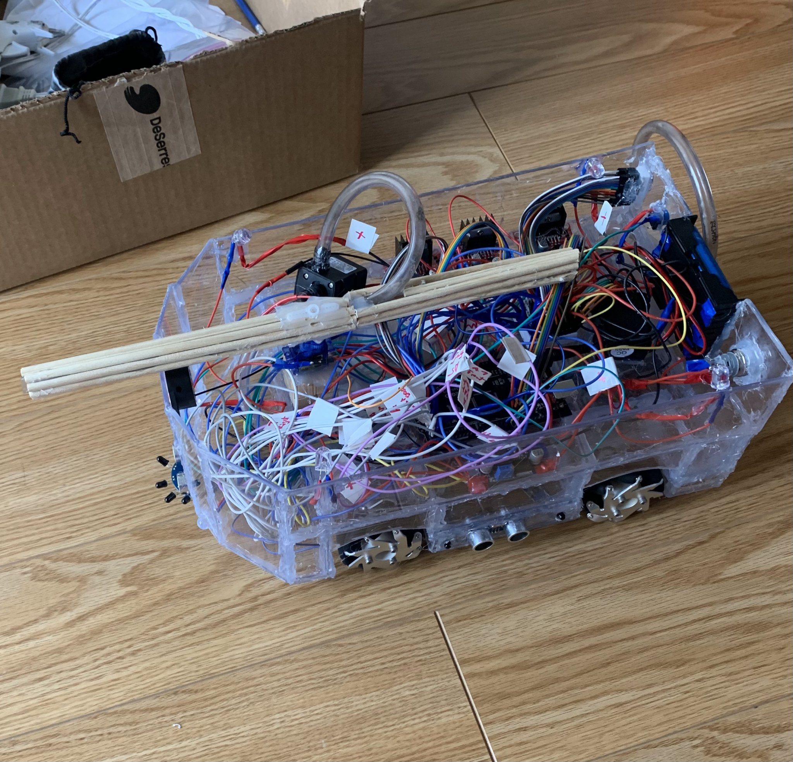
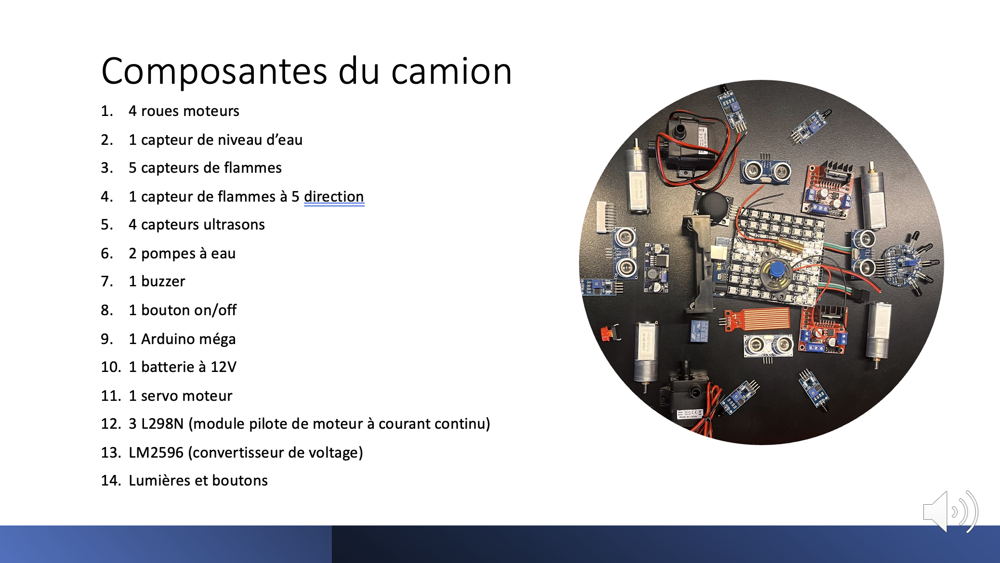
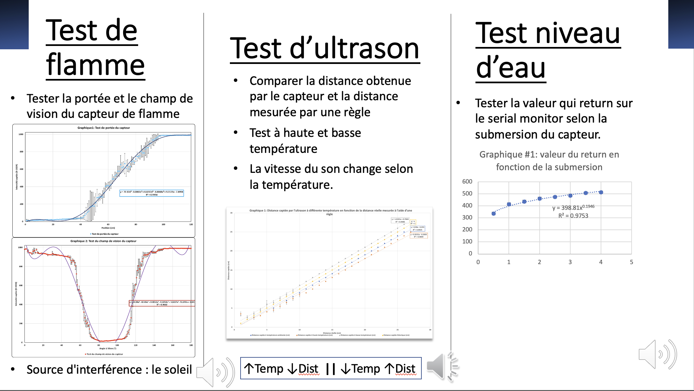
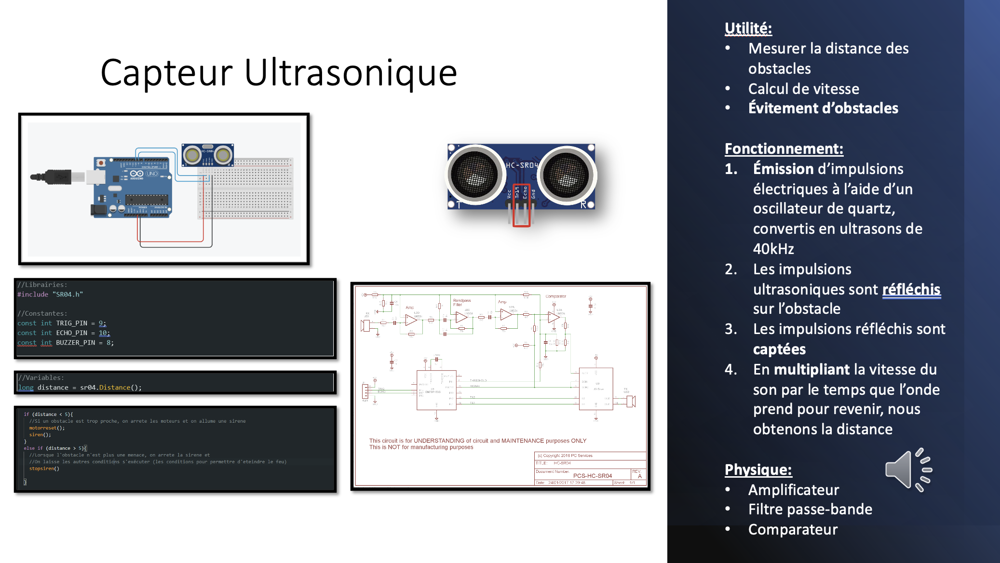
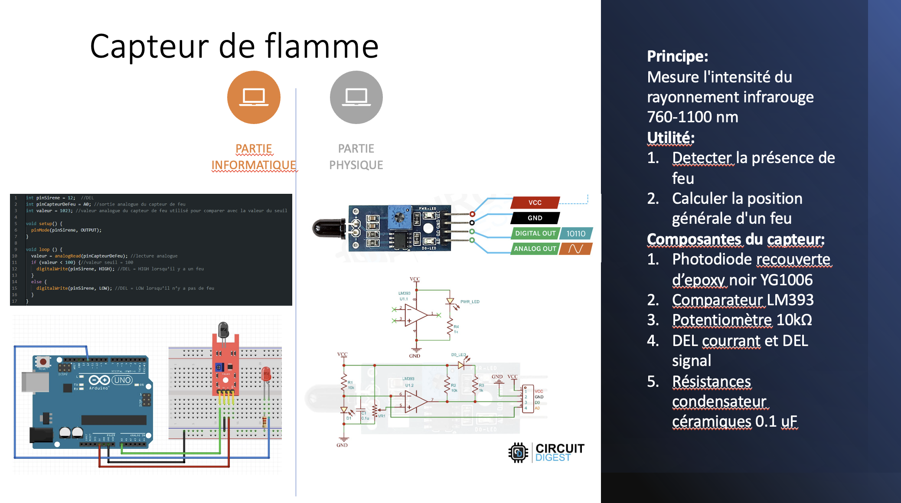
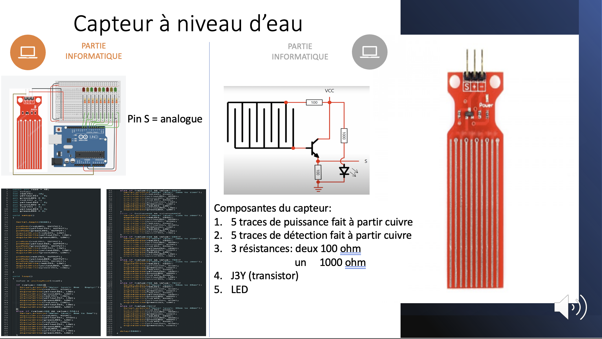

# 🚒 Autonomous Arduino Firetruck

> An Arduino-powered autonomous firetruck that **detects and navigates toward flames**, combining **circuit design**, **mechanical assembly**, and **algorithm development** to extinguish fires with a servo-aimed water nozzle.

  

🎥 Demo video: https://www.youtube.com/watch?v=l2Vn9u5bldI

🏆 Awarded **Best Integration Project** at Collège Jean-de-Brébeuf

---

## 📌 Overview
Inspired by major historical and recent fire disasters, our team built a miniature autonomous firefighting vehicle to explore how low-cost embedded systems can assist with **detection**, **navigation**, and **fire suppression**.

The prototype autonomously searches for a flame source, avoids obstacles, and activates a water spraying sequence once it aligns with the fire.

---

## 🎯 The Challenge
Design a small-scale firetruck that can:
- **Detect flames** without human intervention
- **Navigate toward the fire** while avoiding obstacles
- **Extinguish the flame** efficiently using a limited onboard water reservoir
- Operate reliably despite hardware constraints (water leaks, sensor noise, limited motor torque)

---

## 📸 Media

  
  
  
  
  

---

## ✨ Key Features

### 🧭 Autonomous Navigation
- 4 ultrasonic sensors (Front / Left / Right / Back)
- Stops motors when an obstacle is too close (safety threshold)

### 🔥 Fire Detection + Targeting
- 8 infrared flame sensors positioned around the vehicle to localize fire direction
- Prioritized logic:
  - Center flame detection triggers approach + extinguish
  - Left/right flame detection triggers alignment turns
  - Diagonal/rear detections trigger timed repositioning maneuvers

### 💦 Fire Extinguishing System
- Water output pump to spray
- Servo motor sweeps the nozzle to increase coverage
- Siren (buzzer) during firefighting mode

### 🚰 Water Level Monitoring
- Analog water level sensor
- 10-LED “fuel gauge” style indicator showing remaining water

### 🧴 Refill Mode
- Manual refill button triggers the intake pump for a fixed duration

---

## 🧰 Technical Specifications

### Control System
- **Arduino Mega** (large I/O for many sensors + actuators)

### Sensors
- **Ultrasonic (HC-SR04)**: obstacle detection  
- **IR flame sensors**: flame localization  
- **Custom water level sensor**: remaining water monitoring

### Actuation
- Differential drive DC motors (motor driver control)
- **Two pumps**:
  - Intake pump (refill)
  - Output pump (spray)
- Servo motor for nozzle direction control
- Buzzer for siren feedback

---

## 🧠 Software Architecture

### Main loop stages
1. Read sensors (water level, flame array, ultrasonic distances)
2. Update water-level LED bar
3. Handle refill button
4. Fire response state machine (priority-ordered):
   - Center flame → approach + spray + servo sweep
   - Left/right flame → align via turns
   - Off-axis flame → timed reposition movements
5. Safety stop if any ultrasonic reading is below threshold

### Threshold Calibration
The project uses two detection thresholds:
- `threshold1`: front sensors
- `threshold2`: side/rear sensors

These require tuning depending on ambient light and the specific flame sensors used.

---

## 🗂️ Hardware Pin Map

### Sensors
- Water level: `46`
- Flame: `A1, A3, A5, A6, A7, A8, A9, A10`
- Ultrasonic:
  - Front: trig `29`, echo `23`
  - Left:  trig `33`, echo `31`
  - Right: trig `37`, echo `27`
  - Back:  trig `25`, echo `35`

### Motors
- Enable: `enALB=5`, `enBRB=4`
- Direction: `49, 51, 47, 45`

### Pumps
- Output pump: `enAOUT=8`, `in1OUT=9`, `in2OUT=10`
- Intake pump: `enBIN=3`, `in3IN=11`, `in4IN=12`

### Other
- Servo: `41`
- Fill button: `13` (INPUT_PULLUP)
- Water LEDs: `22,24,26,28,30,32,34,36,38,40`
- Buzzer: `39`

---

## 🚀 Setup / Upload

### Requirements
- Arduino IDE
- Arduino Mega board
- Libraries:
  - `Servo` (built-in)
  - `SR04` (install via Library Manager or include locally)

### Steps
1. Open the project in Arduino IDE
2. Select **Board: Arduino Mega**
3. Select the correct port
4. Upload

---

## 🏁 Achievements & Learnings
- 🏆 Won the **Best Integration Project** award at Collège Jean-de-Brébeuf
- Delivered a functional prototype capable of **detecting and extinguishing simulated fires**
- Solved real-world build issues:
  - Leak-proof water container design
  - Sensor reliability and noise in changing light conditions
  - Balancing vehicle weight vs motor torque
- Gained hands-on experience in:
  - Embedded programming and sensor fusion
  - Mechanical assembly and prototyping
  - Actuator control (motors, pumps, servo)
  - Designing autonomous behavior under constraints

---

## 🔭 Future Directions
- Replace timed turning with closed-loop alignment (turn until centered flame)
- Improve flame localization using sensor weighting / triangulation
- Add better path planning for obstacles (instead of hard stop)
- Upgrade sensors for higher accuracy and robustness
- Optimize mechanical design (lighter chassis, better motor sizing, improved tank seals)

---

## ✅ Conclusion
This project demonstrates how an autonomous vehicle can integrate sensing, navigation, and actuation to support firefighting tasks. While built as a miniature prototype, it highlights the potential of robotics in emergency-response scenarios and provides a strong foundation for future iterations.
